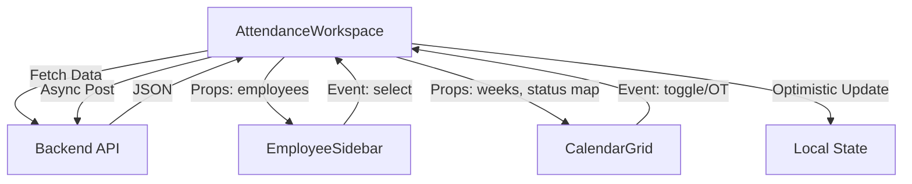

# Developer Guide: Attendance Workspace

## Architecture Overview

The Attendance Workspace is a modular feature within the Astrake EMS UI. It handles the visualization, editing, and finalization of attendance data for a specific billing period.

### Core Components

1.  **`AttendanceWorkspace.vue`** (Orchestrator)
    *   **Responsibility:** Manages global state (`period`, `employees`, `attendanceRecords`), fetches data, and handles all API interactions. It injects data into child components.
    *   **State:**
        *   `period`: The current billing period metadata.
        *   `attendanceRecords`: Flat list of all records for the period.
        *   `currentAttendanceMap`: Computed Map for O(1) access to the currently selected employee's data.
        *   `employeeStatsMap`: Computed Map for O(1) access to aggregated stats (Days/OT) for all employees.

2.  **`UnifiedAttendanceHeader.vue`**
    *   **Responsibility:** Sticky header showing navigation, period details, selected employee context, and global search/actions.
    *   **Features:** Debounced search emit, Save state visualization.

3.  **`EmployeeSidebar.vue`**
    *   **Responsibility:** List of employees available in the period.
    *   **Optimization:** Uses `v-virtual-scroll` to handle large lists efficiently.

4.  **`CalendarGrid.vue`**
    *   **Responsibility:** The main interactive grind. Renders weeks and days.
    *   **Props:** Receives `weeks` (computed layout), `otConfig`, and callback functions for interactions.

### Data Flow

## State Management Decisions

### Normalization
Attendance data is fetched as a flat array of records.
To avoid O(N) searching during rendering (which happens for every cell), we optimize access:
1.  **`currentAttendanceMap`**: When an employee is selected, their records are indexed by `YYYY-MM-DD` into a Map. This makes cell rendering O(1).
2.  **`employeeStatsMap`**: Aggregates are pre-calculated once per data update, storing `{ days, ot }` in a Map by `employee_id`.

### Error Handling
- **API Wrapper:** `retryableFetch` (in `utils/retry.ts`) handles network jitter.
- **Boundaries:** `onErrorCaptured` hook in the main workspace catches any render errors from children, preventing white-screen crashes.

## Testing

### Unit Tests
Located in `scripts/test_units.ts`.
Run with: `bun run scripts/test_units.ts`
Verifies:
- Debounce logic
- Date formatting

### Integration Tests
Located in `scripts/test_attendance_lifecycle.ts`.
Run with: `bun run scripts/test_attendance_lifecycle.ts`
Verifies:
- Full CRUD lifecycle against a running server.
- Locking mechanism.

## Key Files
- `src/ui/pages/AttendanceWorkspace.vue` (Main Logic)
- `src/ui/components/attendance/types.ts` (Shared Interfaces)
- `src/server/api/attendance.ts` (Backend Endpoints)
